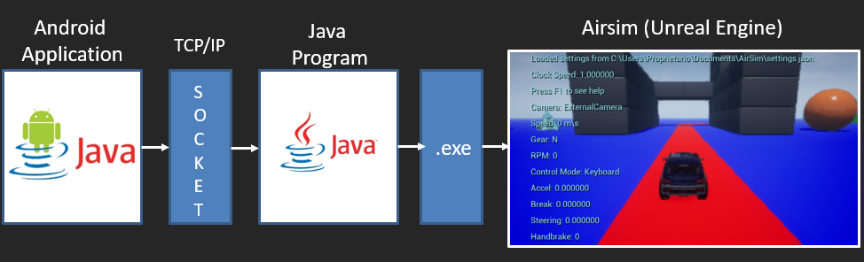
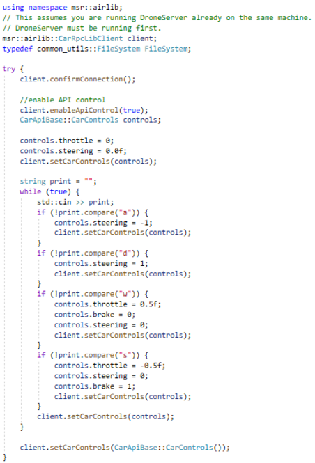
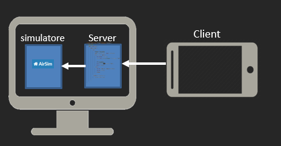
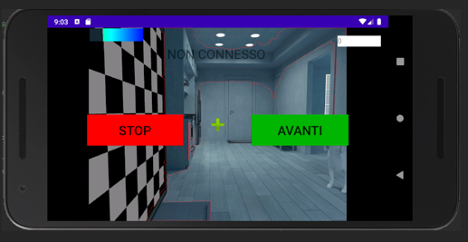
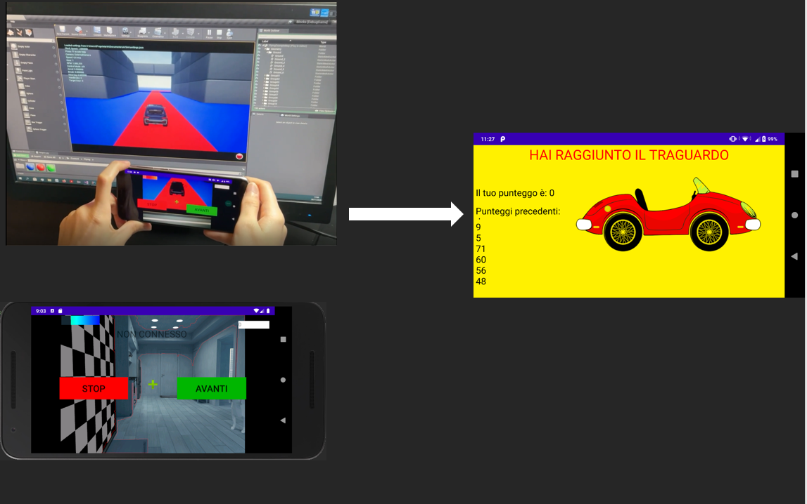

<b><h1> Airsim Control Car </h1></b>

Project in collaboration with Marianna Cossu for HUMAN COMPUTER INTERACTION

<b><h2>Targets</h2></b> 

The aim of this project is to control a car in a simulated environment using a Java application. 

A program written in c++ was used to connect the server and the Airsim application.

To transmit the information from the Android application to the server, we used the socket threads

  

The Android application transmits the following information

-   *Tilt*: Tilting the mobile phone to see whether the car should go left or right 
-   *Stopping button*: Allows the car to be stopped
-   *Avanti button*: Allows the car to accelerate

Through the camera, it is possible to tell whether the car is on the right track. In order to be able to recognise the colours, the openCV libraries were used. 

